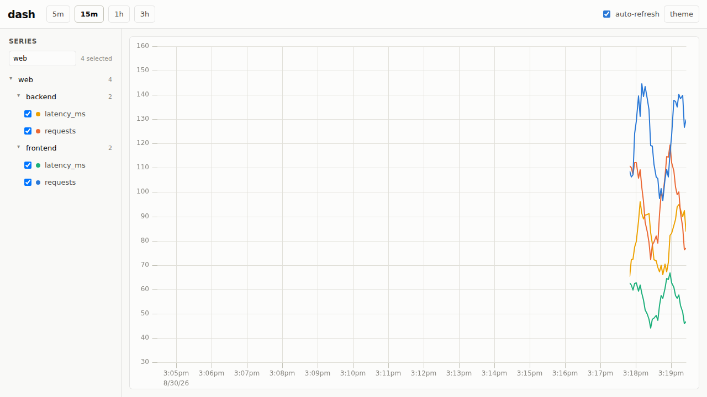

<div align="center">
  <h1>dash</h1>
  <p>A tiny push-based metrics store and live dashboard. In-memory, bit-packed, gone in a few hours.</p>
</div>

---

## About

dash is a minimal Grafana/Graphite-style tool for watching what is happening
*right now*. Clients push metrics over HTTP+JSON; dash holds them in memory
using Gorilla-style compression (delta-of-delta timestamps, XOR-encoded
values — a couple of bytes per point instead of sixteen) and serves a built-in
live dashboard. Retention is a few hours, enforced by dropping whole
compressed chunks, and there is deliberately no persistence: restart the
process and you start fresh.

Metric names form a Graphite-style tree split at the dots
(`web.frontend.latency_ms`), browsable in the UI and queryable with globs.
The storage itself stays flat — the hierarchy is derived on demand, so empty
branches disappear on their own as data rotates out.

Everything ships in one static binary: the web UI and its chart library are
embedded at compile time.



## Features

- Push model over HTTP+JSON — batch-friendly, curl-friendly
- Gorilla-compressed in-memory storage, sharded for concurrent ingest
- Dot-hierarchy metric names with Graphite-style `/find` and `*` globs
- Built-in live dashboard: collapsible series tree, filtering, time-range
  presets, auto-refresh, light/dark theme, shareable URLs, named bookmarks
- Retention by chunk rotation — no compaction, no cleanup jobs, no disk
- Single binary, four dependencies, no configuration required

## Quick Start

```bash
cargo run &

# push a metric (timestamp optional, epoch milliseconds)
curl -s localhost:9090/ingest \
  -H 'content-type: application/json' \
  -d '{"m":"test.answer","v":42}'

# or feed it a demo hierarchy
./scripts/demo.sh &
```

Then open <http://localhost:9090/>.

## Configuration

Environment variables only:

| Variable | Default | Description |
|---|---|---|
| `DASH_ADDR` | `127.0.0.1:9090` | Listen address |
| `DASH_RETENTION_SECS` | `10800` | How long data is kept (3 h) |
| `DASH_CHUNK_SECS` | `1800` | Chunk window; expiry drops whole chunks |

## HTTP API

### `POST /ingest`

Body is a JSON array of points, or a single point object. `ts` is epoch
milliseconds and defaults to server time. Points that are out of order for
their series, older than the retention window, or non-finite are rejected
(counted, not an error).

```bash
curl -s localhost:9090/ingest -H 'content-type: application/json' -d '[
  {"m":"web.frontend.requests","v":1042},
  {"m":"web.frontend.latency_ms","v":73.2,"ts":1788103068401}
]'
# {"accepted":2,"rejected":0}
```

### `GET /query`

`m` may repeat and may contain `*`, which matches within one dot-separated
segment (`web.*.latency_ms` matches `web.backend.latency_ms`, not
`web.a.b.latency_ms`). `from`/`to` accept epoch ms, `now`, or relative values
like `-15m`; `step` accepts `10s`-style durations or plain ms. Defaults:
`from=-1h`, `to=now`, `step` auto-picked for ~300 buckets. Expansion is
capped at 20 series (`"truncated":true` past that). All series share one
time grid. Each bucket keeps its last sample, and empty buckets carry the
newest retained value forward; buckets before the first known value are
`null`.

```bash
curl -s 'localhost:9090/query?m=web.*.latency_ms&from=-15m&step=10s'
# {"step":10000,"from":...,"to":...,"truncated":false,
#  "series":[{"m":"web.backend.latency_ms","points":[[1788103060000,71.8],...]}, ...]}
```

### `GET /find`

One level of the metric tree, Graphite-style. `q` defaults to `*`; its
segment count selects the depth.

```bash
curl -s 'localhost:9090/find?q=web.*'
# [{"path":"web.backend","name":"backend","leaf":false,"leaves":2},
#  {"path":"web.frontend","name":"frontend","leaf":false,"leaves":2}]
```

### `GET /series`

Flat sorted list of every stored metric name.

### `GET /healthz`

Totals for probes and curiosity: `{"series":14,"points":56,"bytes":572}`.

## Running in a container

The published image listens on `0.0.0.0:9090`:

```bash
docker run --rm -p 9090:9090 ghcr.io/nsg/dash:latest
```
